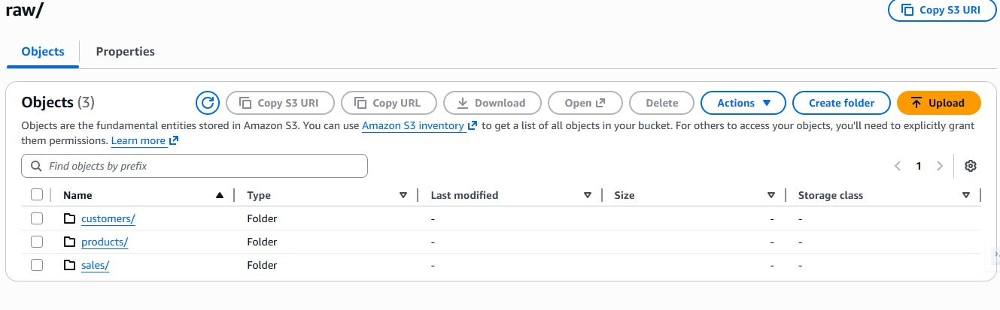
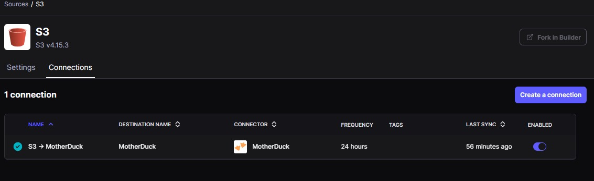
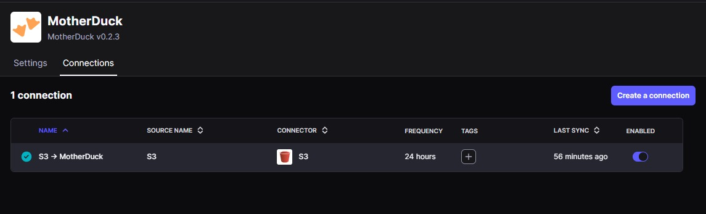
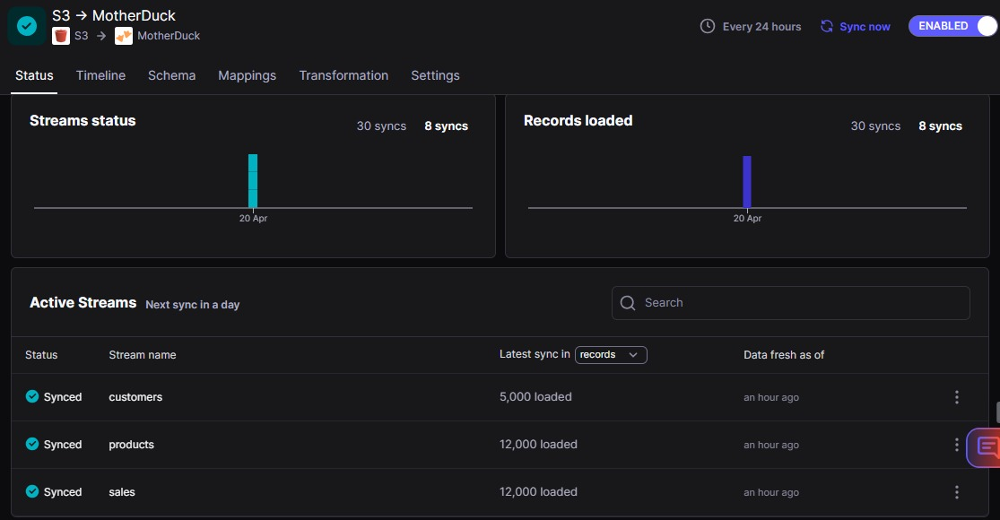
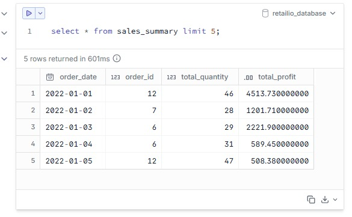
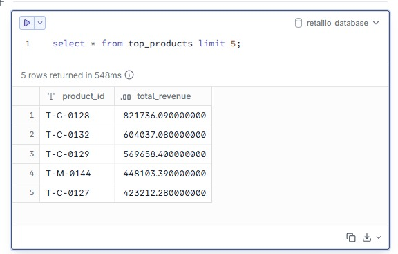

# 📊 Retailio Cloud Data Engineering ELT Pipeline

---

## 📌 Table of Contents
- Overview  
- Architecture  
- Screenshots  
- My Process  
- Built With Tools  
- Challenges  
- What I Learned  
- Author  
- Acknowledgements  

---

## 📌 Overview

This project implements a modern **ELT (Extract, Load, Transform) pipeline** to solve Retailio’s fragmented data challenges.

It centralizes raw retail data into **AWS S3**, automates ingestion using **Airbyte**, and loads structured data into **MotherDuck** for analytics.

The system removes manual reporting workflows and enables **scalable, automated, and reliable data processing** for business insights.

---

## 🏗️ Architecture

AWS S3 (Data Lake - Parquet Files)
        ↓
Airbyte (Data Integration / ELT Tool)
        ↓
MotherDuck (Cloud Data Warehouse)
        ↓
SQL Views (Analytics Layer)

---

## 📸 Screenshots

  
  
  
  
  
  

---

## ⚙️ My Process

- Uploaded raw datasets (sales, customers, products) into **AWS S3** using Python (boto3).
- Converted datasets into **Parquet format** for better performance and storage efficiency.
- Configured **Airbyte Cloud** to connect S3 as the data source.
- Set up **MotherDuck** as the destination warehouse using secure authentication token.
- Executed **Full Refresh Sync** to load data into MotherDuck.
- Performed **SQL validation checks** to ensure data accuracy.
- Created **analytical SQL views** such as `sales_summary` and `top_products`.

---

## 🛠️ Built With Tools

**AWS S3** – Cloud object storage used as a centralized data lake.

**Airbyte** – Data integration tool used for automated ELT pipelines.

**MotherDuck** – Cloud data warehouse built on DuckDB for fast analytics.

**Python (boto3)** – Used for uploading data into AWS S3.

**SQL** – Used for validation, transformation, and analytics.

**Parquet Format** – Columnar storage format for performance optimization.

---

## 🚧 Challenges

- Schema mismatch issues (e.g., incorrect column references like `amount` instead of `sales`).
- Handling Airbyte metadata columns not required for analytics.
- Ensuring consistent Parquet formatting across datasets.
- Validating data consistency between S3 and MotherDuck.

---

## 📚 What I Learned

- Difference between traditional ETL and modern ELT architecture.
- Importance of data lakes (AWS S3) in centralized storage systems.
- How Airbyte simplifies data integration and automation.
- Role of cloud warehouses like MotherDuck in analytics workflows.
- Importance of data validation in production pipelines.
- Benefits of Parquet format for performance and cost efficiency.

---

## 👤 Author

Raj Mohan Reddy Billa  
Data Engineering Intern  

---

## Acknowledgements

- Retailio Project Team  
- Airbyte Documentation  
- AWS Documentation  
- MotherDuck Platform  
- Data Engineering Learning Resources  

---

⭐ If you like this project, feel free to star the repository!